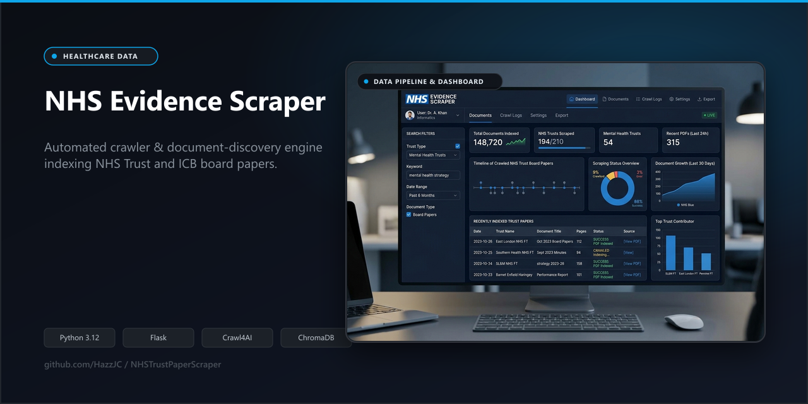

# NHS Evidence Scraper



A document-discovery tool for people who track NHS mental health trust and ICB governance — analysts, researchers, and market/policy teams who currently do this by hand — that crawls trust and ICB websites for board papers, quality accounts, and strategy documents, and mirrors 8 national NHS datasets locally for offline analysis.

---

## Sample output

The scraper writes one metadata record per document found. This is real output from a previous run against a single trust, checked into the repo at [`test_specific_urls_results.json`](test_specific_urls_results.json):

```json
{
  "title": "February 2025 Public Board Papers",
  "url": "https://www.hct.nhs.uk/download/public-board-papers-11-feb-2025pdf.pdf?ver=14539&doc=docm93jijm4n10889.pdf",
  "date": "february 2025",
  "organization": "HCT",
  "org_type": "Trust",
  "org_url": "https://www.hct.nhs.uk/",
  "found_page": "https://www.hct.nhs.uk/our-board"
}
```

Each downloaded file also gets a `.metadata.json` sidecar (source URL, date, report type, scoring detail) alongside it in `downloads/<trust>/<year>/`.

No live demo or hosted instance exists — this is a local Flask dashboard plus a standalone CLI script, run on your own machine against your own `downloads/` folder.

---

## What's verified vs. experimental

This project has two distinct halves that earlier versions of this README blurred together. They are **not equally trustworthy**:

| | Status | Evidence |
|---|---|---|
| **Scraping & downloading** (`scraper/`, `scrape_latest_board_papers.py`) | Working, covered by tests | 8 unit test modules (162+ cases) mocking HTTP responses, retry logic, scoring, and extraction — see [Verified quality evidence](#verified-quality-evidence) |
| **"Sales Intelligence" AI layer** (`intelligence/`, Gemini-powered extraction/RAG/pitch generation) | **Experimental — explicitly untested, no automated tests, no verified output** | Zero test files under `tests/` reference `intelligence/`; requires a paid Gemini API key; output has not been checked for accuracy |

The AI layer is real code that runs, but nobody has verified its output is correct, and it isn't exercised by CI or the test suite. Treat anything it produces (extracted "opportunities," procurement signal classification, generated pitches/emails, natural-language answers) as an unverified draft, not a source of truth — see [Experimental: AI features](#experimental-ai-features-untested) below for what it does and how to disable it.

---

## Quick start (scraping — the verified path)

```powershell
git clone https://github.com/HazzJC/NHSTrustPaperScraper.git
cd NHSTrustPaperScraper
pip install -r requirements.txt
python app.py
```

Open **http://localhost:5002** and tick a source (Trusts / ICBs / National datasets) to start a scrape. No API key is needed for this.

Or use the CLI directly, without the dashboard:

```bash
python scrape_latest_board_papers.py --dry-run          # preview, no downloads
python scrape_latest_board_papers.py --only "Birmingham" --dry-run
python scrape_latest_board_papers.py --limit-per-type 3
```

| Option | Default | What it does |
|---|---|---|
| `--dry-run` | off | Find without downloading |
| `--only "name"` | all | Filter to trusts matching this text |
| `--types all` | `board` | Comma-separated types or `all` |
| `--limit-per-type N` | `1` | Files per trust per type |
| `--all-matches` | off | Download everything found |
| `--max-pages N` | `60` | Crawl depth per site |
| `--output folder` | `downloads` | Download location |

A minimal `requirements-basic.txt` (requests, beautifulsoup4, urllib3) covers just the scraping path if you don't want the Flask/AI dependencies.

---

## What's actually covered

Coverage is real, curated config, not a live directory of every NHS organisation — see [Limitations](#limitations) for what that means in practice.

- **47 NHS Mental Health Trusts** — board papers, quality accounts, annual reports, strategic/digital strategy documents, supplementary papers, CQC reports (7 document types, config in `config/mental_health_trusts.json`)
- **42 ICBs / Commissioners** — Joint Forward Plans, MH strategies, Integrated Care Strategies (config in `config/icb_config.json`)
- **8 national NHS datasets** — MHSDS, OAP, CQC Community MH Survey, NCAP, Fingertips, QOF, PHSMI, NHS Oversight Framework (fetched directly from their publishing sources, saved to `downloads/national/<source>/`)

Both config files are hand-maintained lists of known URLs and start pages, editable via the **Organisation Editor** in the dashboard or by hand.

---

## Responsible data access

This scrapes live NHS trust and ICB websites, so the plan for this project requires documenting exactly what protects those sites from being hammered. Here's what's actually in the code (`scraper/session.py`, `scraper/engine.py`), verified by reading it, not assumed:

**Present:**
- **Identifying User-Agent** — a standard browser UA string is sent on every request (not a custom/identifying one naming the project or a contact — see below)
- **Configurable request delay** — default 0.5s between requests, adjustable 0–5s via the dashboard slider or `crawl_delay` parameter
- **429-aware retry with backoff** — on a 429 response, the scraper honours the `Retry-After` header when present, otherwise backs off exponentially (`min(60, 5 × 2^attempt)`), up to 3 retries (`scraper/session.py`, covered by `tests/test_session.py`)
- **Bounded crawl depth** — `max_pages` caps how many pages per site are visited per job (default 60, capped at 200)
- **Result caching** — previously-successful pages are cached (`data/discovery_cache.json`) and failing orgs are fast-checked against known-good pages before a full re-crawl, reducing repeat load on sites that already failed (`scraper/failure_cache.py`)
- **Concurrency cap** — parallel trust/ICB fetches are capped at 10 simultaneous workers

**Missing / not yet addressed:**
- **No `robots.txt` checking anywhere in the codebase** — the crawler does not fetch or respect `robots.txt` disallow rules on any target site. This is the most significant gap for a tool that crawls dozens of third-party NHS domains and should be treated as a known limitation, not an oversight that's been designed around.
- **No project-identifying User-Agent or contact string** — the UA string is a generic desktop Chrome string, not something a trust's ops team could trace back to this project or reach out about. Standard scraping etiquette (and NHS trusts' own acceptable-use pages, where published) generally expects a UA that names the tool and gives a contact method.
- **TLS verification is disabled by default** (`ScraperEngine(verify_ssl=False)` in `scraper/engine.py`) — requests to trust sites don't validate certificates unless explicitly overridden.
- **No per-trust terms-of-use or acceptable-use review** — individual NHS trust/ICB websites may publish their own scraping/automated-access terms; this project does not check for or track them per-domain.

If you run this against live NHS infrastructure, keep the request delay at 1–2s (the README previously recommended this only as a fix for 429s; treat it as the sane default instead), avoid `--all-matches` runs across all 47+42 orgs back-to-back, and don't run it as a recurring/scheduled job without adding `robots.txt` support first.

---

## Architecture

```
scraper/
  constants.py          URL patterns, keywords, 10 report-type definitions
  discovery.py           Crawl loop — follows links from configured start URLs
  scoring.py              Keyword scoring and document-type classification
  downloader.py          File download and naming
  engine.py                ScraperEngine — trust + ICB job management, threading
  national_datasets.py  8 national dataset fetchers (direct downloads, not crawled)
  national_engine.py    NationalFetchEngine — job manager for national fetches
  failure_cache.py        Tracks orgs with no results, for fast-check on retry
  session.py                HTTP session: UA, timeout, 429 retry/backoff, crawl delay

intelligence/            EXPERIMENTAL — see below. Not covered by tests.
  database.py, pipeline.py, runner.py, embeddings.py, matching.py

config/
  mental_health_trusts.json   47 trust entries: name, base URL, start URLs
  icb_config.json                    42 ICB entries: name, base URL, start URLs

data/                          Auto-managed caches (failure_cache.json, discovery_cache.json)
templates/, static/    Flask dashboard UI
app.py                        Flask app and all routes
```

The dashboard (`app.py` + `templates/index.html`) is a thin UI over `ScraperEngine` / `NationalFetchEngine`; `scrape_latest_board_papers.py` is an independent CLI entry point into the same `scraper/` package, so scraping logic is exercised both ways.

---

## Verified quality evidence

- **8 test modules, 1,372 lines, covering the scraping path**: `tests/test_session.py` (retry/backoff/429 handling — happy path, HTTP errors, network errors, crawl delay), `tests/test_engine.py`, `tests/test_extraction.py`, `tests/test_failure_cache.py`, `tests/test_national_datasets.py`, `tests/test_scoring.py`, `tests/test_app_routes.py`. All use mocked HTTP responses (`unittest.mock`) — they do not hit live NHS sites.
- Run them yourself:
  ```bash
  pip install -r requirements.txt
  pytest
  ```
- **CI gap, stated plainly**: `.github/workflows/ci.yml` currently runs `pre-commit` (isort, black, yaml/whitespace checks) on pull requests — it does **not** run `pytest`. The test suite exists and passes locally but is not enforced automatically yet. Treat "tests exist" and "tests are checked in CI" as two different claims until that's wired up.
- No test coverage exists for `intelligence/` — see below.

---

## Experimental: AI features (untested)

`intelligence/` uses Google's Gemini API to read downloaded PDFs and produce structured summaries, a natural-language Q&A search (RAG via ChromaDB + sentence-transformers embeddings), supplier-to-trust matching, and draft outreach emails/pitches, surfaced at `/intelligence` in the dashboard.

**This is explicitly unverified.** No automated tests exist for any of `intelligence/database.py`, `pipeline.py`, `runner.py`, `embeddings.py`, or `matching.py`, and no sample output from this layer has been checked for accuracy against source documents. Extraction quality, hallucination risk, and correctness of "confidence scores" are all unknown.

If you want to try it anyway: it requires a `GEMINI_API_KEY` in a `.env` file (copy `.env.example`) and the full `requirements.txt` (chromadb, sentence-transformers, google-genai). Without a key, `/intelligence` routes return `503` and the rest of the app — scraping and downloading — works normally. If you don't set the key, none of this code path runs.

Do not rely on this for anything where accuracy matters until it has test coverage and someone has checked its output against ground truth.

---

## Limitations

- **Coverage is a curated list, not the whole NHS.** 47 mental health trusts and 42 ICBs are hand-maintained in `config/*.json`; acute, community, and ambulance trusts outside that list aren't covered. Adding an org means adding a config entry, not something the tool discovers automatically.
- **No `robots.txt` support** (see [Responsible data access](#responsible-data-access) above) — the single biggest thing to fix before running this unattended or at scale.
- **Site-specific brittleness.** Trusts that require JavaScript to render their document list need `"js_render": true` set manually per config entry; sites that change their page structure will silently return fewer/no results until someone updates `COMMON_PATHS`/start URLs.
- **AI features are untested** (see above) — excluded from anything described as "working" in this README.
- **CI does not run the test suite** (see above) — only linting is automated today.
- **TLS verification is off by default** for scraped sites.
- **No hosted/demo instance.** This runs locally against your own filesystem; there's nothing to click a link to.

---

## Troubleshooting

**A trust or ICB isn't finding documents** — check the **Failure Log** in the dashboard, then use the **Organisation Editor** to add the correct publications page as a start URL; re-run with dry-run first to confirm.

**429 rate-limit errors** — increase the request delay slider to 1–2s. Retries are automatic, but a higher base delay avoids triggering the limit at all.

**The scraper visits the right page but finds no PDFs** — the site likely needs JavaScript to render its document list; set `"js_render": true` on that config entry.

**`GEMINI_API_KEY is not set`** — expected if you haven't configured the (experimental, untested) AI layer. Scraping and downloading work without it.

---

## Attribution & data provenance

All documents fetched by this tool originate from the public-facing websites of NHS trusts, ICBs, and national NHS/OHID/CQC data publishers — this project does not host, mirror, or redistribute any content beyond what each organisation already publishes openly. Source URL and retrieval date are recorded in every file's `.metadata.json` sidecar so provenance is always traceable back to the original publisher. See [Responsible data access](#responsible-data-access) for what governs how those sites are accessed.

Maintained by [HazzJC](https://github.com/HazzJC).
